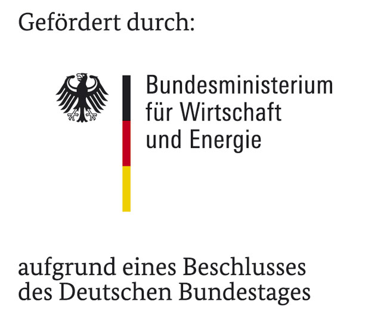

.. richardsonpy documentation master file, created by
   sphinx-quickstart on Tue Sep 11 10:55:35 2018.
   You can adapt this file completely to your liking, but it should at least
   contain the root `toctree` directive.

richardsonpy
============

Python version of Richardson tool.
richardsonpy includes codes to generate stochastic domestic user, appliance, and lighting profiles. 

.. toctree::
   :maxdepth: 2
   :caption: Contents:

Indices and tables
==================

* :ref:`genindex`
* :ref:`modindex`
* :ref:`search`

Original version published under GNU GENERAL PUBLIC LICENSE by
Ian Richardson,
Murray Thomson and
David Infield
CREST (Centre for Renewable Energy Systems Technology),
Department of Electronic and Electrical Engineering,
Loughborough University, Leicestershire LE11 3TU, UK
and
Department of Electronic & Electrical Engineering, University of Strathclyde,
UK

see: 

https://dspace.lboro.ac.uk/dspace-jspui/handle/2134/3112

and

https://dspace.lboro.ac.uk/dspace-jspui/handle/2134/5786

Python version provided by:
Institute for Energy Efficient Buildings and Indoor Climate,
E.ON Energy Research Center, RWTH Aachen University

Installation
============

Installation is possible via pip:

'pip install richardsonpy'

(for static installation into your current Python distribution)

or

clone development version via git and install via pip (egglink):

'pip install -e <your_path_to_richardsonpy>'

Dependencies
============

richardsonpy requires the following Python packages:
	- numpy
	- matplotlib
	- xlrd

References
============

[1] I. Richardson, M. Thomson, D. Infield, 
A high-resolution domestic building occupancy model for energy demand simulations, 
Energy and Buildings 40 (8) (2008) 1560 1566.

[2] I. Richardson, M. Thomson, D. Infield, A. Delahunty, 
Domestic lighting: A high-resolution energy demand model, 
Energy and Buildings 41 (7) (2009) 781 789.

[3] I. Richardson, M. Thomson, D. Infield, C. Clifford, 
Domestic electricity use: A high-resolution energy demand model, 
Energy and Buildings 42 (10) (2010) 1878 1887.

License
============

richardsonpy is released by RWTH Aachen University's Institute for Energy Efficient Buildings and Indoor Climate (EBC) 
under the GNU GENERAL PUBLIC LICENSE 

https://www.gnu.org/licenses/gpl-3.0.en.html

Acknowledgements
=================

Grateful acknowledgement is made for financial support by Federal Ministry for Economic Affairs and Energy (BMWi), 
promotional references 03ET1138D.

Moreover, we would like to thank Ian Richardson, Murray Thomson and David 
Infield for providing the basic tool version as open-source tool.

